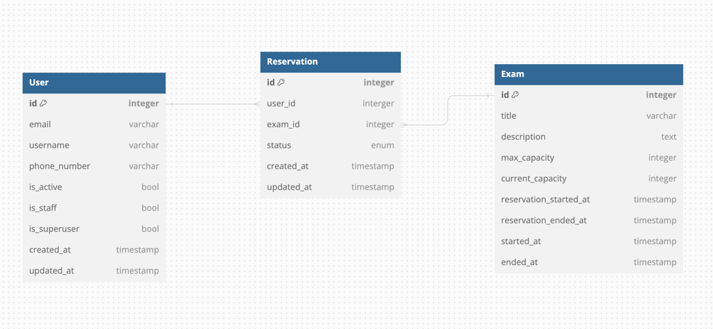

# 코드 실행
1. `docker-compose -f infra/docker-compose.yaml up -d`
- 실행전, 본인 로컬에서 8000, 5432, 6379, 80번 포트 사용중인걸 모두 종료해주세요.
- `.env.sample` 파일의 이름을 `.env` 로 변경해주세요.
- Backend: 8000
- PostgresQL: 5432
- Redis: 6379
- Nginx: 80
- Docker-Compose 로 실행하지 않는다면 로컬에서 압축푼뒤, runserver 명령을 통해서도 가능 (sqlite3 삭제후 재생성 권장)
  - 로컬에서는 sqlite3
  - docker-compose는 prod 환경일때를 가정하여 db, cache, nginx 등 붙였습니다.

  
2. 회원가입과 같은 특수한 API 를 제외하고 대부분의 API는 유저인증이 되어있어야 합니다.<br>아래의 API 명세 또는 [Swagger](http://localhost/swagger/) 을 통해 회원가입과 로그인후 access_token 을 header 에 넣어주셔야 합니다.


# ERD



# 사용 기술
- python3.12
- django==4.2.7
- djangorestframework==3.15.2
- authentication (token based jwt)
- permission
- pagination

# API 명세
프로젝트 파일의 `postman_collection.json` 을 postman툴에 import 해주세요.


**주의**

포스트맨 툴로 import 시킨뒤에, 포트번호 8000번으로 되어있는부분을 모두 없애주셔야 됩니다. 
docker-compose up 으로 실행시키게되면 상용환경으로 실행시키는걸 가정하였기에 nginx 가 붙어있어 80번 포트로 요청보내게 됩니다.

> [Swagger](http://localhost/swagger/) 을 참고하거나 postman_example.json 파일을 import 하셔도 됩니다.
> 스웨거는 docker-compose up을 통해 실행한 경우 상용환경으로 인식하여 swagger 페이지가 보이지않습니다.

### User (샘플)

|                  | Method | Endpoint                     | Data                                 | Auth required |
| ---------------- | ------ | ---------------------------- | ------------------------------------ | ------------- |
| 유저 목록 조회   | GET    | /api/v1/users/               |                                      |               |
| 유저 단일 조회   | GET    | /api/v1/users/{id}/          |                                      |               |
| 유저 회원 가입   | POST   | /api/v1/users/               | username, email, password, password2 |               |
| 유저 회원 탈퇴   | DELETE | /api/v1/users/{id}/          |                                      | O             |
| 유저 로그인      | POST   | /api/v1/users/login/         | email, password                      |               |
| 유저 로그인 갱신 | POST   | /api/v1/users/login/refresh/ |                                      |               |
| 유저 로그아웃    | POST   | /api/v1/users/logout/        | refresh                              | O             |
| **내 정보 조회** | GET    | /api/v1/users/me/            |                                      | O             |


# 특별히 신경 쓴 부분
1. 요구사항에 있는 인증/인가 또는 비즈니스 로직들
2. 확장가능한 디렉토리 구조로 설계하느라고 신경썼습니다.
3. 공통모듈은 모두 core 패키지안에 위치시켜 재사용 가능하도록 변경했습니다.
3. `api/v1, api/v2, api/v3` 로 추후 분기처리 가능하도록 패키지를 구성했습니다.
4. 예약확정시, 예약 데이터의 빈번한 업데이트 및 동시접근 가능성을 고려하여 트랜잭션 및 락을 사용하도록 처리하였습니다.


# 최종 구현된 범위
- 요구사항 전부


# 추가하면 좋을것
- 시간을 계산하는 로직에서 django timezone 을 직접 불러다 쓰는부분을 TimeHelper 와 같은 클래스를 만들어서 한곳에서 관리하고, 재사용 가능한 함수를 만들어서 호출하는게 좋을것 같습니다.
- Django Debug Toolbar 를 도입해서 각 API 들이 호출하는 SQL쿼리 횟수를 보고 select_related, prefetch_related 등을 사용하여 쿼리를 최적화 할것 같습니다.

# 고민 포인트
- Serializer 에서 비즈니스 로직까지 처리시키는게 맞을지 고민입니다.
- model 에 비즈니스 로직이 포함되는게 좋은지, Service 레이어를 만드는게 나은지 고민중입니다.
- model 정의 부분에 manager와 queryset 에 filter(), annotate() 같은 함수를 두어 repository 역할을 하게 하는게 맞는지, 아니면 따로 repository 레이어를 두는게 맞는지 고민입니다.


# ENV
```
# DJANGO
SECRET_KEY='django-insecure-c4!s(6lk2km#d&2+cnelljxgtg@shv_w@@avq0(mv4%8*h16c1'

# DB
DB_NAME='postgres'
DB_USER='postgres'
DB_PASSWORD='postgres'
DB_HOST='db'
DB_PORT='5432'

# Cache
REDIS_HOST='redis://redis:6379/0'
```
